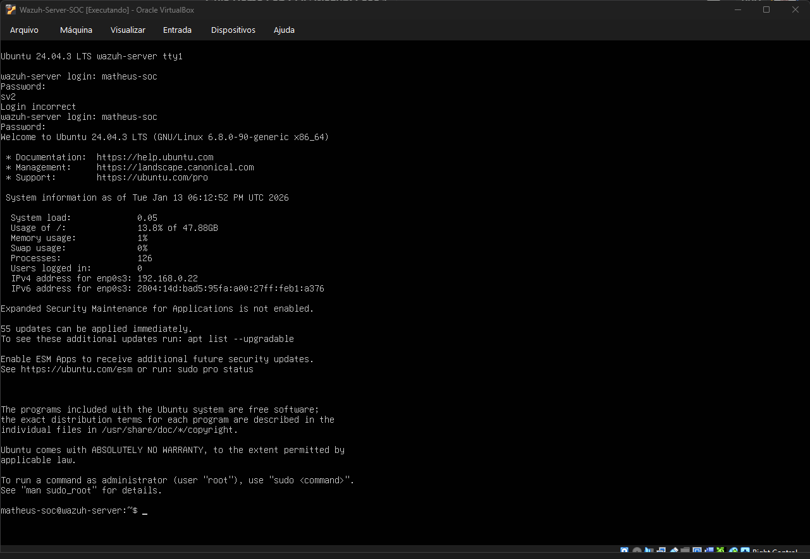
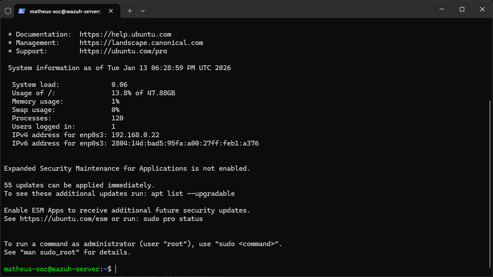
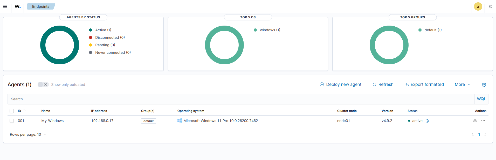

# Wazuh SOC Home Lab: Deployment and Threat Detection

## Project Overview
This project demonstrates the end-to-end deployment of a **Wazuh SIEM/XDR** ecosystem. It covers the infrastructure setup, remote management, agent enrollment, real-time threat detection, and forensic log analysis, simulating a professional Security Operations Center (SOC) environment.

---

## Phase 1: Operating System Deployment
[cite_start]To host the Wazuh SIEM, I deployed an **Ubuntu Server 24.04 LTS** instance[cite: 1, 2]. [cite_start]This environment was configured with 8GB of RAM and 50GB of storage to ensure high performance during log analysis[cite: 3]. [cite_start]The network was set to **Bridge Mode** to allow seamless communication between the server and monitored endpoints[cite: 4].

## Phase 2: Establishing Secure Remote Management (SSH)
[cite_start]To streamline the deployment and management of the Wazuh server, I established a remote connection from my Windows host to the Ubuntu VM using the **SSH protocol via PowerShell**[cite: 5, 6]. [cite_start]This setup confirms network reachability and allows for more efficient command execution[cite: 7, 8].
* [cite_start]**Target:** matheus-soc@192.168.0.22 [cite: 9]
* [cite_start]**Port:** 22 (Default SSH) [cite: 10]

## Phase 3: Automated Deployment of Wazuh SIEM/XDR
[cite_start]Following the validation of the Ubuntu environment, I initiated the deployment of the **Wazuh ecosystem (v4.9.2)**[cite: 11, 12]. [cite_start]The installation script performed automated checks for hardware requirements (CPU/RAM) and generated the necessary security certificates for encrypted communication[cite: 15, 16, 17].

## Phase 4: Successful Provisioning and Service Validation
[cite_start]The automated installation script concluded successfully, marking the completion of the SIEM server infrastructure[cite: 21, 22]. [cite_start]All core components, including the **Wazuh Indexer, Manager, and Dashboard**, were provisioned and initialized without errors[cite: 23, 25, 26, 28].

## Phase 5: Web Interface Integration and Initial Telemetry
[cite_start]I accessed the **Wazuh Dashboard** via HTTPS using the server's local IP (192.168.0.22)[cite: 30, 31]. [cite_start]This stage confirmed the proper integration between the Indexer and the Dashboard UI[cite: 32]. [cite_start]Upon initial login, the system already recorded **21 security events** related to internal server processes[cite: 35].

## Phase 6: Agent Enrollment Configuration
[cite_start]To begin active monitoring, I initiated the agent enrollment process through the Wazuh Dashboard[cite: 37, 38]. [cite_start]I configured a **Windows MSI** package for the local host, assigning the server address and naming the agent **'My-Windows'**[cite: 41, 42, 43].

## Phase 7: Successful Agent Synchronization and Visibility
[cite_start]This stage marks the successful establishment of active monitoring[cite: 45, 46]. [cite_start]The Wazuh Manager is now receiving real-time telemetry from the Windows 11 Pro endpoint, confirming that the communication channel is secure and operational[cite: 48, 49].

## Phase 8: Threat Detection and Event Correlation Analysis
[cite_start]The SIEM successfully triggered alerts for suspicious activity on the 'My-Windows' endpoint[cite: 52, 54]. [cite_start]The dashboard recorded **3 Authentication Failure** events, which were automatically mapped to the **MITRE ATT&CK** framework (Account Access)[cite: 56, 57].

## Phase 9: Deep Log Analysis and Forensic Investigation
[cite_start]I analyzed the raw event data to understand the nature of the security breach[cite: 60, 61]. [cite_start]The investigation revealed **Event ID 4625** (Failed Logon) with **Logon Type 3** (Network-based), providing granular evidence of unauthorized credential testing[cite: 65, 66, 67].

## Phase 10: Incident Response and Remediation
[cite_start]Following the detection of the brute-force attempt, I implemented a structured **Incident Response** protocol[cite: 68, 69]:
* [cite_start]**IP Blocking:** Simulated an IP block via Windows Firewall to prevent further connection attempts[cite: 71].
* [cite_start]**Account Hardening:** Reviewed the **Account Lockout Policy** to ensure accounts are automatically disabled after 5 failed attempts[cite: 73].
* [cite_start]**Service Review:** Audited RDP/SMB settings to ensure remote access is restricted to authorized users only[cite: 74].

## Phase 11: Conclusion and Key Takeaways
[cite_start]The successful deployment of this Cybersecurity Home Lab provided a comprehensive view of the **Detection and Response** lifecycle[cite: 76, 77]. [cite_start]This project solidifies my foundation as a **Junior SOC Analyst**, demonstrating the technical maturity required to monitor, detect, and respond to modern cyber threats in an enterprise environment[cite: 84].
